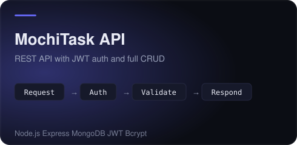

  &nbsp;
  &nbsp;
  &nbsp;
  

 

  

 

    
    
    
  

 

  &nbsp;

  &nbsp;

 

  
  

 

  <picture>
    <source media="(prefers-color-scheme: dark)" srcset="assets/snake-dark.svg" />
    <source media="(prefers-color-scheme: light)" srcset="assets/snake-light.svg" />
    
  </picture>

 

  

